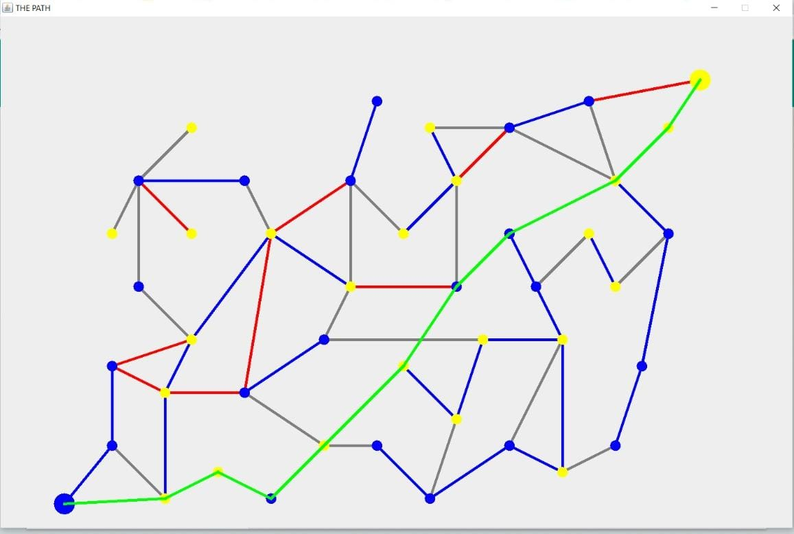

# Traveller-puzzle-solution-generator
(using Graph data structure)

## Puzzle : 
In this scenario we have two warring kingdoms, the yellow and the blue kingdom. Both kingdoms have their capitals and
are surrounded by a network of towns. Some are loyal to the yellow kingdom and some are loyal to the blue kingdom. Relations between 
neighboring towns are often strained if their allegiances are at odds. Thankfully, political power of the castles ensures that cities
belonging to the same castle are never in war. If two neighboring towns belonging to opposite kingdoms are quarreling at a given time 
then the road connecting the two towns is blocked.

A messenger needs to travel from the capital of blue kingdom to the capital of yellow kingdom carrying an offering of peace 
as quickly as possible. He has the map of the region but to find the quickest route he needs to know which of the roads 
is blocked and plan his route accordingly.

The player will act as informant with news of the local quarrels between towns and 
let the messenger know which of the roads are blocked currently. 
### The shortest safe path (if such exists) will be accordingly calculated and displayed.

##### The problem statement:  

##### After user blocks the edges: (example)  

##### Solution: (example)  
 
 

Language :  
### Java
